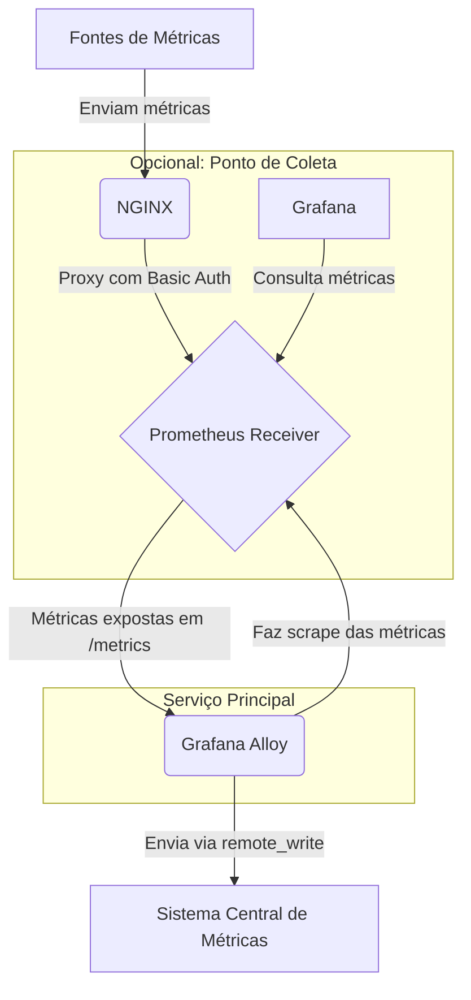

# Grafana Alloy Metrics Forwarder com Docker Compose

Este repositório contém uma configuração robusta, baseada em Docker Compose, para implantar o **Grafana Alloy**. Ele atua como um coletor e encaminhador de métricas de alta performance, projetado para fazer o scrape de um endpoint Prometheus e encaminhar os dados de forma segura para um sistema de armazenamento de métricas compatível com `remote_write`, como Grafana Mimir, Cortex ou Thanos.

## Visão Geral da Arquitetura

Este projeto implementa uma arquitetura desacoplada para coleta e encaminhamento de métricas. O fluxo de dados é o seguinte:



-   **Grafana Alloy (`grafana-alloy`)**: O coração da solução. Utiliza a linguagem de configuração **River** (`.alloy`) para definir o pipeline de dados. Ele faz o scrape do serviço `prometheus-recebedor` e encaminha as métricas via `prometheus.remote_write`.
-   **Prometheus Receiver (`prometheus-recebedor`)**: (Opcional, comentado) Uma instância do Prometheus configurada com o modo `web.enable-remote-write-receiver`. Sua função é agregar métricas de múltiplas fontes antes de serem coletadas pelo Alloy.
-   **NGINX (`nginx`)**: (Opcional, comentado) Atua como um reverse proxy para o `prometheus-recebedor`, adicionando uma camada de segurança essencial através de autenticação (`Basic Auth`).
-   **Grafana (`grafana`)**: (Opcional, comentado) Instância para visualização e dashboards, que pode ser conectada ao `prometheus-recebedor` para análise local das métricas.

## Pré-requisitos

-   **Docker Engine**: Versão 20.10.0 ou superior.
-   **Docker Compose**: Versão V2.

## Estrutura do Diretório

```
.
├── alloy-config/               # Configuração do Grafana Alloy (River)
│   └── config.alloy
├── docker-compose.yml          # Arquivo principal que orquestra os serviços
├── nginx-config/               # Configuração e senhas do NGINX
│   └── default.conf
├── prometheus-config/          # Configuração do Prometheus Receiver
│   └── prometheus-recebedor.yml
└── .gitignore                  # Arquivos a serem ignorados pelo Git
```

## Configuração

Siga estes passos para configurar o ambiente antes da execução.

### 1. Variáveis de Ambiente

As credenciais para o endpoint de `remote_write` são gerenciadas por variáveis de ambiente, uma prática recomendada para evitar a exposição de segredos. Crie um arquivo `.env` na raiz do projeto.

**`.env.example`** (use como template):

```dotenv
# Credenciais para autenticação no endpoint de remote_write do Alloy
USUARIOALLOY=seu_usuario
SENHAALLOY=sua_senha_segura
```

**Ação**: Copie este template para um arquivo `.env` e substitua pelos valores corretos.

### 2. Configuração do Grafana Alloy (`config.alloy`)

O arquivo em `alloy-config/config.alloy` define o comportamento do Alloy.

-   **`prometheus.scrape "PROMETHEUS"`**: Este bloco instrui o Alloy a coletar métricas. O alvo (`__address__`) está configurado para `prometheus-recebedor:9090`.
-   **`prometheus.remote_write "default"`**: Este bloco encaminha as métricas coletadas. **É crucial que você altere o parâmetro `url`** para o endereço do seu sistema de monitoramento.

    ```river
    // alloy-config/config.alloy
    prometheus.remote_write "default" {
        endpoint {
            // IMPORTANTE: Substitua pela URL do seu endpoint de remote_write
            url     = "http://192.168.1.11/api/v1/write"
            headers = {
                "X-Scope-OrgID" = "AzureTenant",
            }
            basic_auth {
              username = sys.env("USUARIOALLOY")
              password = sys.env("SENHAALLOY")
            }
        }
    }
    ```

### 3. Ativando Serviços Opcionais

Para usar os serviços `prometheus-recebedor`, `nginx` ou `grafana`, descomente as seções relevantes no arquivo `docker-compose.yml`.

Se ativar o `nginx`, você precisará criar um arquivo de senhas para a autenticação básica. O `.gitignore` já está configurado para ignorar o arquivo `.auth`.

```sh
# Instale o apache2-utils se necessário (ex: sudo apt-get install apache2-utils)
htpasswd -c ./nginx-config/.auth seu_usuario_nginx
```

## Execução

1.  **Clone o repositório** e navegue até a pasta.

2.  **Configure o ambiente**: Crie o arquivo `.env` e ajuste a URL no `config.alloy`.

3.  **Inicie a stack de serviços** em modo detached:
    ```sh
    docker-compose up -d
    ```

4.  **Verifique o status dos containers**:
    ```sh
    docker-compose ps
    ```

5.  **Monitore os logs do Alloy** para confirmar que a coleta e o encaminhamento estão funcionando sem erros:
    ```sh
    docker-compose logs -f grafana-alloy
    ```

## ⚠️ Considerações de Segurança Críticas ⚠️

-   **NUNCA FAÇA COMMIT DE SEGREDOS**: O arquivo `.gitignore` está configurado para ignorar `.auth`. **Adicione o arquivo `.env` ao seu `.gitignore`** para evitar o commit acidental de credenciais.

-   **ARQUIVO `apps.json`**: Se você possui um arquivo chamado `apps.json` neste diretório, ele contém uma quantidade massiva de segredos de produção (chaves de API, strings de conexão, etc.). **DELETE ESTE ARQUIVO IMEDIATAMENTE** e garanta que ele não exista no histórico do seu repositório Git. A exposição deste arquivo representa uma vulnerabilidade de segurança de extrema gravidade.
